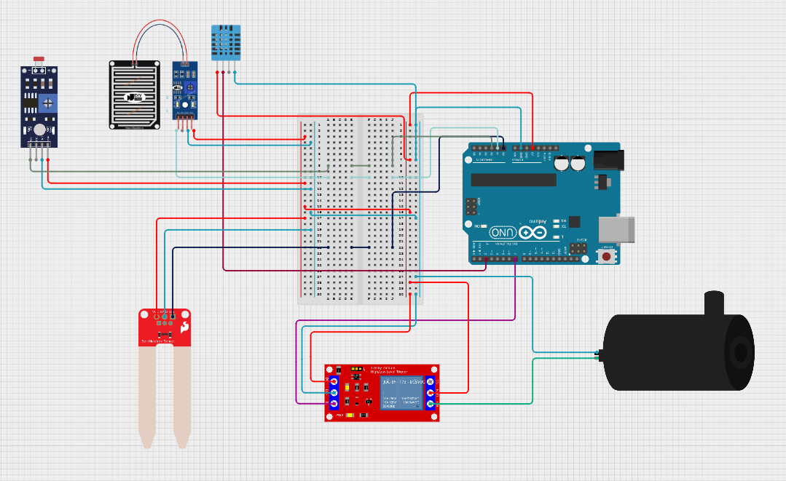

# Smart Garden Automation System

## What is this Project?
The **Smart Garden Automation System** is an **IoT-based plant watering project** that waters plants automatically based on soil moisture, weather conditions, and rain detection.  
It ensures plants are watered **only when needed**, saves water, and prevents overwatering.

---
## Circuit Diagram

---

## Logic and How it Works
The system uses multiple sensors to make watering decisions in this order of priority:

1. **Rain sensor** – always checked first. If rain is detected, the pump is turned OFF immediately.  
2. **LDR (Light Dependent Resistor)** – detects day or night. Watering happens **only during daytime**.  
3. **Soil moisture sensor** – checks if the soil is dry. Pump only runs if soil is dry.  
4. **DHT11 sensor** – measures temperature to determine water amount:  
   - Hot day → pump ON for **longer duration**  
   - Normal day → pump ON for **shorter duration**

**Workflow Example:**
- Morning, soil dry, no rain → Pump ON  
- Afternoon, it rains → Pump OFF immediately  
- Night → No watering  

---

## Components and Tech Stack
**Hardware Components:**
- Arduino UNO  
- DHT11 Temperature & Humidity Sensor  
- Soil Moisture Sensor  
- Rain Sensor  
- LDR (Light Dependent Resistor)  
- Relay Module  
- Water Pump  

**Software / Tech Stack:**
- Arduino IDE  
- C++ (Arduino programming)  

---

## Pins Configuration
| Component             | Pin/Connection        | Notes                          |
|-----------------------|---------------------|--------------------------------|
| DHT11                 | D2                  | Data pin                       |
| Soil Moisture Sensor  | A0                  | Analog output                  |
| Rain Sensor           | A1                  | Analog output                  |
| LDR                   | A2                  | Analog output (voltage divider)|
| Relay Module (Pump)   | D7                  | ACTIVE LOW                     |
| Pump                  | Connected via Relay | External power recommended     |

---

## How to Use
1. Connect all sensors and the pump to the Arduino as per the pin configuration.  
2. Upload the provided Arduino code to the Arduino UNO using the Arduino IDE.  
3. Open the Serial Monitor to see live sensor readings and pump status.  
4. Adjust threshold values in the code if necessary after testing sensors.  

---

## Features
- Automatic watering based on **soil moisture**  
- Stops watering during **rain**  
- Prevents watering at **night**  
- Adjusts water amount based on **temperature**  
- Saves water and protects plant roots  

---
